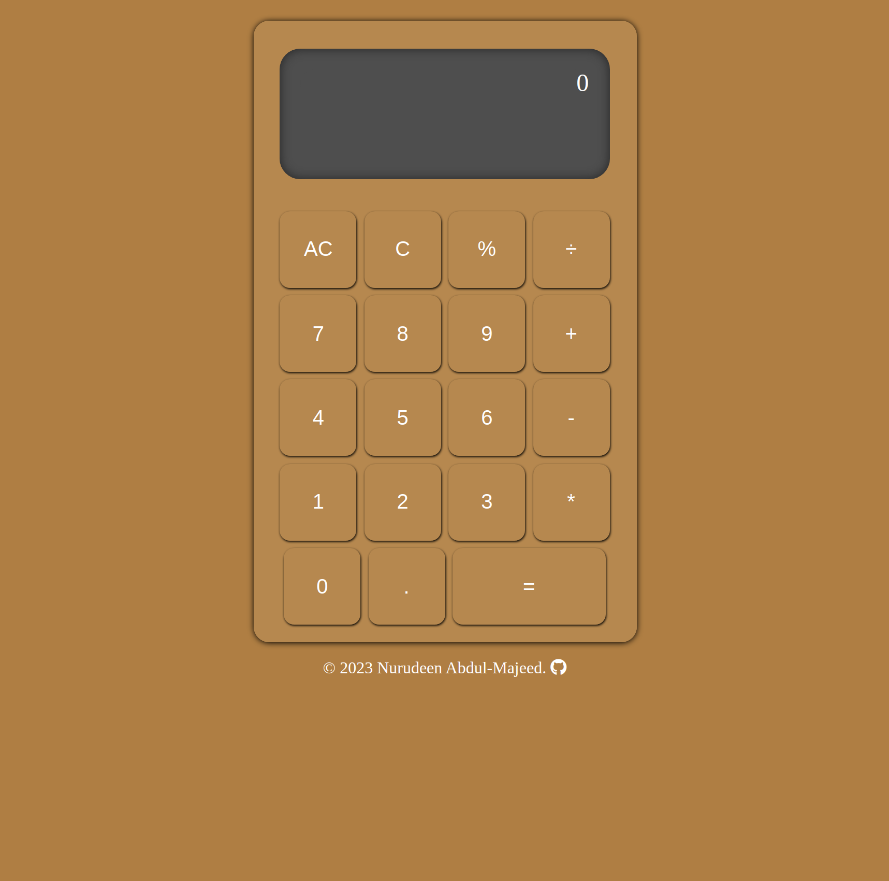

# A-Calculator

This is a solution to the [Calculator project in The Odin Project curriculum](https://www.theodinproject.com/lessons/foundations-calculator).

## Table of contents

- [Overview](#overview)
  - [The challenge](#the-challenge)
  - [Screenshot](#screenshot)
  - [Links](#links)
- [My process](#my-process)
  - [Built with](#built-with)
  - [What I learned](#what-i-learned)
  - [Continued development](#continued-development)
  - [Useful resources](#useful-resources)
- [Author](#author)
- [Acknowledgments](#acknowledgments)

## Overview

### The challenge

The calculator:

- Should contain buttons for all of the basic math operators you typically find on simple calculators.
- Operation will consist of a number, an operator, and another number.
- Should allow users should to be able to string together several operations and get the right answer.
- Should not evaluate more than a single pair of numbers at a time.
- Should round answers with long decimals so that they don’t overflow the screen.
- Pressing “clear” should wipe out any existing data.
- Display a snarky error message if the user tries to divide by 0…
- Users should be able to type in their prefered decimal number. Thus, there should be a point button.
- Should have a keyboard support.

### Screenshot



### Links

- Source code URL: https://github.com/nuru484/A-Calculator
- Live Site URL: https://nuru484.github.io/A-Calculator/

## My process

### Built with

- Semantic HTML5 markup
- CSS custom properties
- Flexbox
- CSS animations and transitions
- Vanila JavaScript
- JavaScript DOM manipulation

### What I learned

```html
<h1>
  I recap my knowledge about adding a favicon and also HTML icons. I also learnt
  about how to structure HTML for easy Flexbox styling
</h1>
```

```css
.what-I-learnt-about-CSS {
  I learned how to use flexbox for layouts.
}
```

```js
const proudOfThisFunc = () => {
  console.log("I learned more about DOM manipulation and event listeners");
};
```

### Continued development

The calculator currently doesn't have the keyboard support functionality, I will be adding it and any other useful feature I think should be added.

### Useful resources

- [Interneting Is Hard](https://internetingishard.netlify.app/html-and-css/flexbox/index.html) - This website helped me in getting clear understanding of Flexbox and how to work with it.
- [OpenAI](https://chat.openai.com/?model=text-davinci-002-render-sha) - I use ChatGPT to get simple explanations of complex syntax and the ones I just met.

## Author

- Twitter - [@ABDULMAJEEDNUR3](https://twitter.com/ABDULMAJEEDNUR3)
- GitHub - [@Nuru484](https://github.com/nuru484)

## Acknowledgments

Big thanks to myself for not giving up on this journey, I shall get there someday, Insha Allah.
